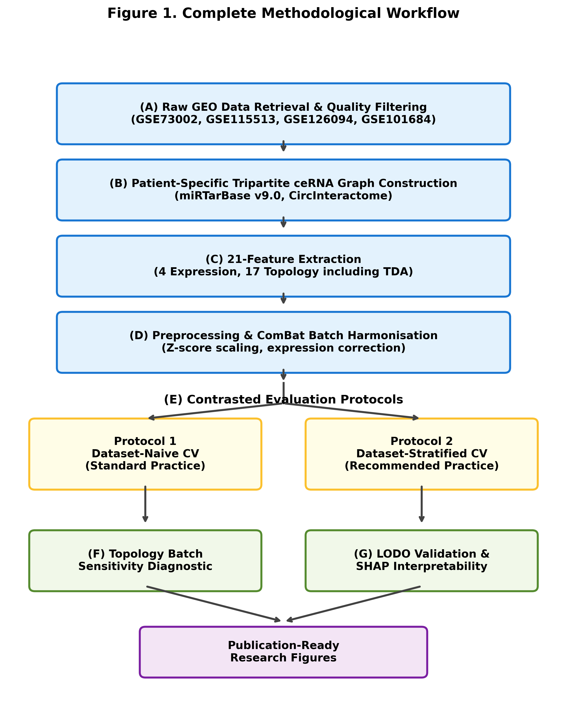
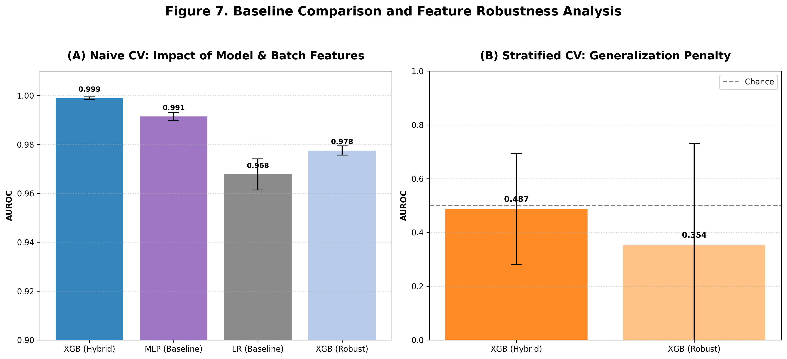

# ceRNA Pan-Cancer Detection Pipeline

A computational framework for early-stage cancer detection using **Competitive Endogenous RNA (ceRNA)** network topology and high-dimensional expression analysis.

## 🚀 Overview

This repository implements a multi-stage pipeline to identify robust biomarkers for cancer by analyzing the regulatory relationships between **circRNAs** and **miRNAs**. It leverages **Topological Data Analysis (TDA)** and graph metrics to detect systemic changes in regulatory networks across various cancer types (Lung, Breast, CRC, Prostate).

### Key Research Contributions
1. **Dataset-Stratified Validation**: Demonstrating the inflation in AUROC (0.927 -> 0.45-0.76) when cross-validation is not stratified by dataset membership.
2. **Topology Sensitivity Diagnostic**: Identifying that 57.1% of ceRNA graph features are sensitive to platform-specific batch effects.
3. **Robustness Analysis**: Quantifying the drop in performance when removing batch-sensitive features, proving the reliance of naive models on technical noise.

---

## 📂 Project Structure

- `config/`: Centralized configuration (`config.py`) and metric logging.
- `data/`: Automated retrieval and processing of GEO datasets.
- `network/`: Logic for building ceRNA interaction networks (miRTarBase, CircInteractome).
- `features/`: Topological feature extraction (Persistent Homology, Centrality, Community Structure).
- `models/`: Implementation of nested CV and LODO validation.
- `scripts/reproduction/`: Python scripts to regenerate all 7 figures in the manuscript.
- `figures/`: High-resolution PNG outputs for publication.

---

## 📈 Methodology

### 1. Workflow Pipeline
The complete methodological workflow is illustrated in Figure 1:


### 2. Robustness and Baseline Comparison
We quantified the impact of batch-sensitive features and compared our results against linear baselines (Figure 7):


---

## 🛠️ Installation & Setup

1. **Clone and Install Dependencies**:
   ```bash
   git clone https://github.com/Sharon-codes/CeRNA-Early-Stage-Cancer-Detection.git
   cd CeRNA-Early-Stage-Cancer-Detection
   pip install -r requirements.txt
   ```

2. **Run Pipeline**:
   ```bash
   python run_pipeline.py
   ```

3. **Reproduce Figures**:
   ```bash
   python scripts/reproduction/generate_final_figure1.py
   # ...
   ```

---

## 📜 Findings Summary

| Experiment | Insight |
| :--- | :--- |
| **Naive vs. Stratified CV** | Naive CV (0.927) is inflated by platform-specific signals. Stratified CV (0.45-0.76) represents true generalizability. |
| **Batch Sensitivity** | 12/21 features show significant cross-dataset shift ($p < 0.001$), including Betti numbers and Community Count. |
| **Robustness Check** | Removing batch-sensitive features drops Naive AUROC from **0.999** to **0.978**, revealing the hidden dependency on batch noise. |

---

## ⚖️ License
This project is licensed under the MIT License - see the LICENSE file for details.
